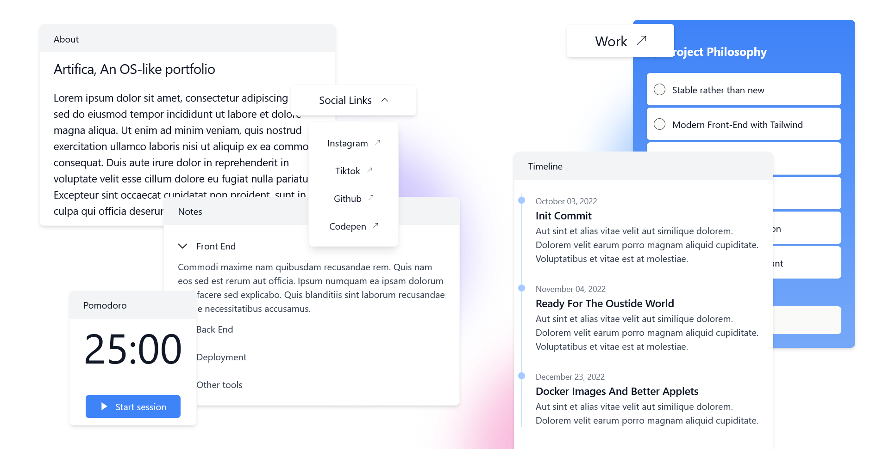

# Artifica - A personal OS-like portfolio.

> Artifica is a work in progress and a personal project.

Artifica is an OS-like Personal Web Portfolio designed following the [Fluent Design System](https://www.microsoft.com/design/fluent/) made by Microsoft for the Windows operating system. It was inspired by the awesome [MAD](https://mad.ac/) Studio's page.




## Features

- Powered by Django.
- Wagtail as the CMS.
- Modern Front-End workflow.
- Easy to add JS & CSS libraries.
- Ready to deploy with Docker.
- Developed following the [the 12-factor methodoly](https://www.12factor.net/).
- Support for light/dark mode.
- _Almost_ functional "applets".

## Stack

- Django
- Wagtail
- Docker
- Tailwind CSS & Flowbite
- ESbuild
- SQLite/PostgreSQL
- Memcached

## Why?

I have always liked my portfolios to present information about me and my stack, as well as my expertise. And Artifica is not an exception to that.

Artifica's design is my way of breaking down the multiple areas in which I have been developing professionally throughout my career as a software developer. But, by dividing these areas into "applets" rather than sections, I am trying to show how all these areas are interrelated.

## What are applets?

Applets are the keystone on which the idea and the development of Artifica is based. Basically, they are small components that try to fulfill different functions. For example, some applets are just links to other sites or sections while others pretend to have functionality and work as a full application.

The list of applets and their functionality is a work in progress but the list of applets that can be used right now is:

- Button.
- Contact.
- Social links.
- Notes.
- Pomodoro.
- Textual applet.
- Todo.

> You can create and update these applets using the Wagtail admin page.

## Installation

The best way to start working with Artifica is to clone this respositoy:

```bash
git clone https://github.com/daniarlert/artifica
```

Setup a Python's virtual environment and install the dependencies. I personally prefer to use [poetry](https://python-poetry.org/) but since the requirements are listed in a plain `requirements.txt` you can use any tool you want.

Since Artifica uses modern Front-End libraries like Tailwind CSS and some npm modules, you would also need to have installed Node.js in your development setup.

This project also has setup some git hooks, mainly focused on the maintenance of the dependencies and the code format. To activate them, run with the virtual environment activated the following command:

```bash
pre-commit install
```

## Development setup

> TODO:

### Front-End

> TODO:

### `ENV` variables

For development:

```plain
DEBUG=on
```

For production:

```plain
ALLOWED_HOSTS=

DATABASE_ENGINE=
DATABASE_HOST=
DATABASE_PORT=
DATABASE_NAME=
DATABASE_USER=
DATABASE_PASSWORD=
DATABASE_URL=

CACHE_ENGINE=
CACHE_URL=

SECRET_KEY=

DJANGO_LOG_LEVEL=
DJANGO_LOG_BASIC_FILE=
DJANGO_LOG_DETAILED_FILE=
```

If you are using the `docker-compose.yaml` file, it in fact, expects an `.env.prod` file with most of the above `env` variables.

## Logging

> TODO:

## Deploy

> TODO:

### Docker image

> TODO:

### Docker compose

> TODO:

### Platforms

> TODO:

## Development in progress

Artifica is a work in progress and a personal project. By this I mean that there will be certain features that I will not implement and others that I will work on at my own discretion.

If you are someone who wants to contribute to the code of this project please open an issue first.

## Contributions

This project follows the [conventional commits](https://www.conventionalcommits.org/en/v1.0.0/) specification. If a contribution does not follow this specification, it will not be accepted. Code with bad formatting will also not be accepted.
